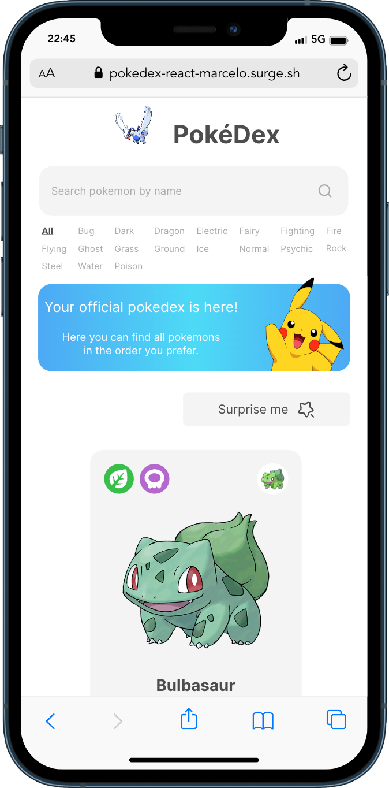

<h1 style="text-align: center; font-weight: bold;">Pokédex</h1>

<div align="center" >
  
</div>

## Sobre o Projeto

A pokedéx é um site para você conhecer todos os detalhes sobre os Pokémons!

Link da aplicação em produção:

https://pokedex-react-marcelo.surge.sh/

### Tecnologias Usadas

- [React](https://pt-br.reactjs.org/)
- [TypeScript](https://www.typescriptlang.org/)
- [Sass](https://sass-lang.com/)
- [Axios](https://axios-http.com/ptbr/docs/intro)
- [Eslint](https://eslint.org/)
- [Prettier](https://prettier.io/)
- [React Router](https://reactrouter.com/en/main)
- [React Hook Form](https://react-hook-form.com/)
- [Poke API](https://pokeapi.co/)

### Como rodar a aplicação

```bash
# Clone este repositório
$ git clone https://github.com/marrcelosantana/pokedex
# Acesse a pasta do projeto
$ cd pokedex
# Instale as dependências
$ npm install
# ou
$ yarn
# Execute a aplicação em modo de desenvolvimento
$ npm run dev

```

### Imagens

|               Macbook               |
| :---------------------------------: |
|  |

|                 Iphone                 |                 Ipad                 |
| :------------------------------------: | :----------------------------------: |
|  |  |
